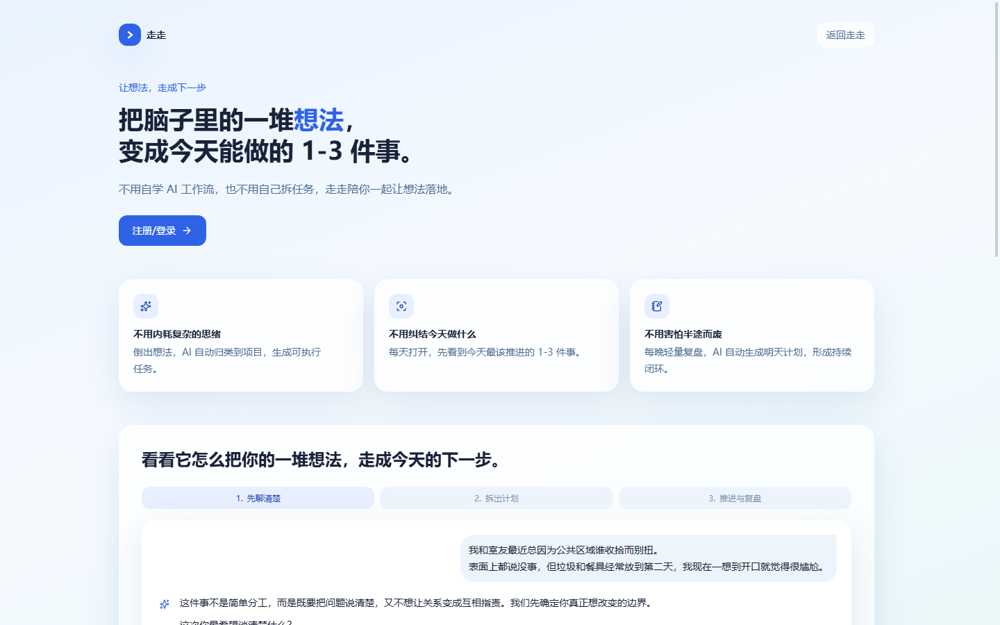
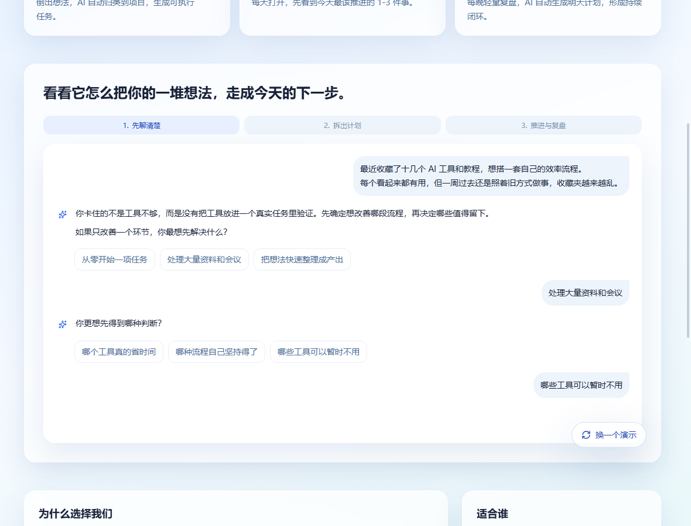
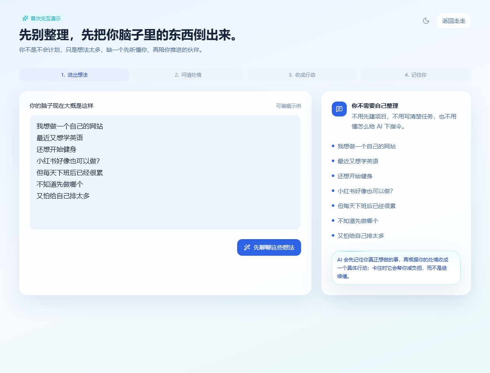
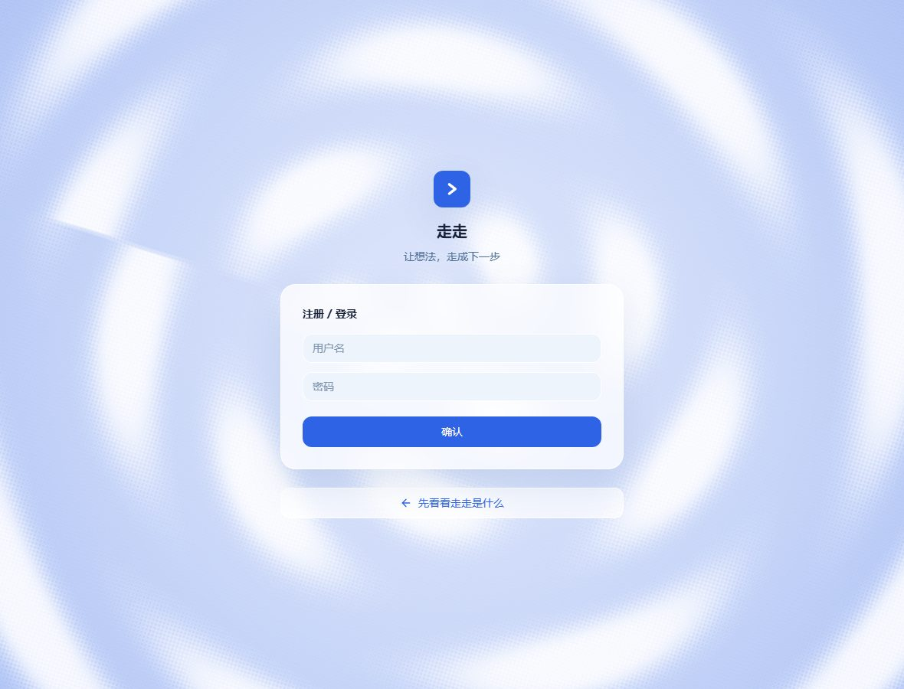
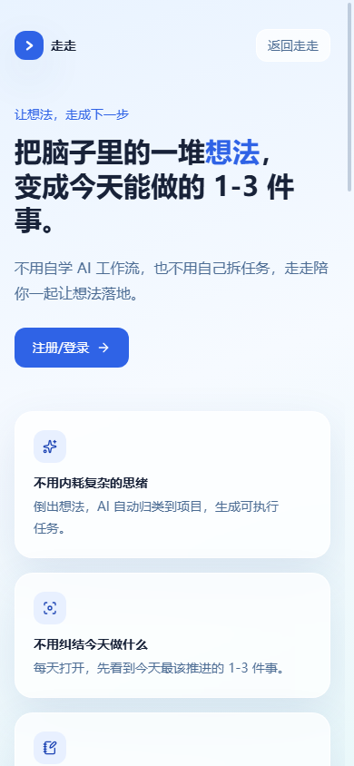

# 走走

> 把脑子里的一堆想法，走成今天能做的 1-3 件事。

<p align="center">
  <a href="https://nextstep9.work"><strong>在线体验</strong></a>
  &nbsp;·&nbsp; v2.5
  &nbsp;·&nbsp; Coded by 氵
</p>

<p align="center">
  
</p>

## 为什么做走走

很多工具能帮你记待办，但真正让人停住的通常不是“记不下来”：

- 想法太多，不知道现在该推进哪一个；
- 目标太大，今天不知道从哪一步开始；
- 做完没有复盘，下一次又回到原地。

走走把这件事收成一个闭环：

`记想法 → 澄清 → 拆解 → 今天行动 → 复盘 → 下一轮`

它不是替你堆更多任务，而是把一句真实想法收成一条今天能开始、完成后能验证的行动。

## 界面预览

| 对话澄清 | 首次演示 |
| --- | --- |
|  |  |

| 登录页 | 移动端 |
| --- | --- |
|  |  |

## v2.5 收束版

- **先听懂，再拆解**：AI 先理解对象、场景和真正想推进的方向，不急着生成一堆任务。
- **任务有执行合同**：每条任务都有执行方式、完成标准、最大轮次和工具策略。
- **小任务不工程化**：quick 任务一轮结束，不无限追问，不自动生成无穷尽的后续任务。
- **书桌管理项目和任务**：支持项目、任务、便利贴、状态和优先级管理。
- **复盘接回下一步**：保存复盘时，后续任务自动归入对应项目，形成下一轮行动。
- **工具匣按状态展示**：待整理、未完成、已完成、复盘分别使用对应色系。
- **落地页保留 5 个处境**：工具过载 / 关系沟通 / 创作选择 / 时间诊断 / 复杂活动，首次进入随机选一版。
- **完成 3 个任务后反馈**：页面底部出现「有改进意见？十分感谢！」入口，意见会保存进 `usage_events`。
- **首次引导代码保留**：当前按 v2.5 的收束界面为准，需要时可以重新启用。

## 适合谁

| 适合 | 不适合 |
| --- | --- |
| 想法多、项目杂，需要每天重新聚焦的人 | 已经有稳定 GTD 流程，不需要 AI 帮你判断的人 |
| 正在学习、创作、求职或做自由职业，容易开始不了的人 | 只想让 AI 替你执行任务，不想做取舍的人 |
| 希望把“做完一件事”接成下一轮行动的人 | 需要复杂团队协作和多人项目管理的人 |

## 技术栈

- Next.js 15 + React 19 + TypeScript
- Tailwind CSS 4
- Prisma 6 + PostgreSQL
- lucide-react
- EdgeOne Pages

## 本地运行

需要 Node.js 22+ 和 pnpm。

```bash
pnpm install
pnpm db:migrate:deploy
pnpm dev
```

打开 <http://localhost:3000>。

本地开发时，数据库连接、AI Key 和会话密钥通过 `.env` 配置，不要提交到仓库。

## 目录

```text
src/app/          页面、路由和 Server Actions
src/components/   交互组件
src/lib/          AI、数据库、任务合同和通用逻辑
prisma/           数据模型与迁移
docs/             部署、设计说明和界面预览
scripts/          备份、评估和维护脚本
```

## 部署

生产部署只使用 EdgeOne Pages：

- 部署分支：`codex/edgeone-deploy`
- 构建命令：`npm run build:edgeone`
- 正式域名：<https://nextstep9.work>

`build:edgeone` 会依次执行：

```bash
prisma generate
prisma migrate deploy
next build
```

推送 `codex/edgeone-deploy` 后会自动触发 EdgeOne 构建。部署期间可能出现极短的静态资源切换窗口，等待资源就绪或强制刷新即可。

## 数据与安全

- 每个账号只能访问自己的项目、任务、笔记和复盘。
- AI 请求由服务端统一发起，API Key 只放在托管平台环境变量中。
- 游客数据只保存在当前浏览器会话中；注册后才会长期保存。
- Prisma 迁移会随构建部署执行，发布前确认数据库环境变量已配置。

---

<p align="center">走走 v2.5 · Coded by 氵</p>